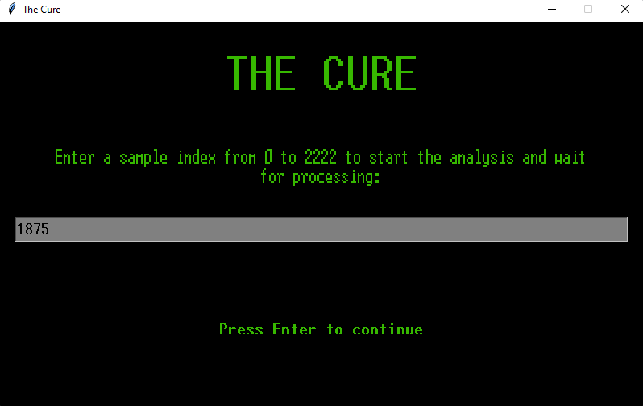

# <p align="center">The Cure</p>

> Project for the application of the Prim's Algorithm in the Algorithm and Data Structures course of the Information Systems (SI) at the Center for Informatics (CIN) - UFPE.

<details>
  <summary>Menu</summary>
  <details>
    <summary>English</summary>
    <ol>
      <li><a href="#requirements">Requirements</a></li>
      <li>
        <a href="#context">Context</a>
        <ul>
          <li><a href="#problem">Problem</a></li>
          <li><a href="#database">Database</a></li>
        </ul>
      </li>
      <li>
        <a href="#implementation">Implementation</a>
        <ul>
          <li><a href="#used-algorithm">Used Algorithm</a></li>
          <li><a href="#development">Development</a></li>
          <li><a href="#used-libraries">Used Libraries</a></li>
          <li><a href="#github-repository">GitHub Repository</a></li>
        </ul>
      </li>
      <li><a href="#conclusion">Conclusion</a></li>
      <li>
        <a href="#screenshots">Screenshots</a>
        <ul>
          <li><a href="#figure1">Figure 1</a></li>
          <li><a href="#figure2">Figure 2</a></li>
          <li><a href="#figure3">Figure 3</a></li>
          <li><a href="#figure4">Figure 4</a></li>
          <li><a href="#figure5">Figure 5</a></li>
          <li><a href="#figure6">Figure 6</a></li>
          <li><a href="#figure7">Figure 7</a></li>
          <li><a href="#figure8">Figure 8</a></li>
          <li><a href="#figure9">Figure 9</a></li>
          <li><a href="#figure10">Figure 10</a></li>
          <li><a href="#figure11">Figure 11</a></li>
        </ul>
      </li>
      <li><a href="#collaborators">Collaborators</a></li>
    </ol>
  </details>
  <details>
    <summary>Português</summary>
    <ol>
      <li><a href="#requisitos-preliminares">Requisitos preliminares</a></li>
      <li>
        <a href="#contexto">Contexto</a>
        <ul>
          <li><a href="#problema">Problema</a></li>
          <li><a href="#banco-de-dados">Banco de Dados</a></li>
        </ul>
      </li>
      <li>
        <a href="#implementação">Implementação</a>
        <ul>
          <li><a href="#algoritmo-utilizado">Algoritmo Utilizado</a></li>
          <li><a href="#desenvolvimento">Desenvolvimento</a></li>
          <li><a href="#bibliotecas-utilizadas">Bibliotecas Utilizadas</a></li>
          <li><a href="#github">GitHub</a></li>
        </ul>
      </li>
      <li><a href="#conclusão">Conclusão</a></li>
      <li>
        <a href="#capturas-de-tela">Capturas de Tela</a>
        <ul>
          <li><a href="#figura1">Figura 1</a></li>
          <li><a href="#figura2">Figura 2</a></li>
          <li><a href="#figura3">Figura 3</a></li>
          <li><a href="#figura4">Figura 4</a></li>
          <li><a href="#figura5">Figura 5</a></li>
          <li><a href="#figura6">Figura 6</a></li>
          <li><a href="#figura7">Figura 7</a></li>
          <li><a href="#figura8">Figura 8</a></li>
          <li><a href="#figura9">Figura 9</a></li>
          <li><a href="#figura10">Figura 10</a></li>
          <li><a href="#figura11">Figura 11</a></li>
        </ul>
      </li>
      <li><a href="#colaboradores">Colaboradores</a></li>
    </ol>
  </details>
</details>

## Requirements

Firstly, please ensure that you have met the following requirements (specific instructions for running in VSCode):

* You have installed the `python` plugin
* You have installed the `anaconda terminal` plugin
* You have installed the `pandas` library using the following command:
```
pip install pandas
```
* You have installed the `Gephi` software on your machine, in the following path (only necessary for visualizing the final minimum spanning tree):
```
C:\Program Files
```
* Modify the path to the Gephi executable in the `Main.py` file if necessary
* When `Gephi` initializes, some configurations will still be required. You can observe them from _Figure 4_ to _7_

## Context

### Problem

In 2050, it was a challenging period for humanity. An unknown virus emerged, triggering a new global pandemic. Modern science and medicine were in a race against time to find a cure for this invisible threat spreading across entire continents. After the collaboration of various research centers, a crucial discovery was made: there was a specific gene that, when combined with other properties, could be used to create the cure. And this genetic key was hidden near the almost extinct mangrove regions in the state of Pernambuco, Brazil.
</br>
To find the required human gene, scientists had to collect various samples detailing the correlation between genes and the degree of infection to which they were exposed. But there was an additional challenge: they had to find the most resistant sample, the one that could withstand virus mutations and become the basis for the cure.
</br>
To achieve this, scientists applied the Prim algorithm, a powerful minimum spanning tree tool. This allowed them to efficiently and effectively explore the vast array of collected samples, identifying crucial patterns and connections in their quest for the gene of hope.
</br>
Finally, after countless tries, sample collections, and days of intensive study, the foundational gene for the cure was found. With the discovery in hand, scientists could begin working on the solution. It was a complex and time-consuming process, but hope was rekindled. Gradually, the cure began to be distributed worldwide, and the pandemic came to an end.

### Database

The database used in this work was the [SC-CC (Biological Networks)](https://networkrepository.com/bio-SC-CC.php), which contains information about functional associations between genes, including edge weights. To manipulate the database, the file was transformed into CSV format, and the data was separated into: Gene 1 (vertex 1), Gene 2 (vertex 2), and Degree of Infection (weight).

## Implementation

### Used Algorithm

Prim's Algorithm - Minimum Spanning Tree

### Development

Stages:

1. Database Processing and Graph Creation;
2. Prim Algorithm Creation and Calculation Systems;
3. Graph Visualization and Graphic Interface;
4. Readme and Project Report.

### Used Libraries

- `Pandas`: We utilized the _pandas_ library for reading the CSV database, converting the file into a DataFrame, and exploring each item within the DataFrame to create the graph.

- `Random`: We employed the _random_ library to generate random numbers during calculations for deaths. 

- `Tkinter`: We applied the _tkinter_ library to create user graphical user interfaces (GUIs).

### GitHub Repository

Link to the repository: 
```
https://github.com/luiz-linkezio/Algoritmo_PRIM-Algoritmo_e_Estrutura_de_Dados-SI-CIN-UFPE-2023.1  
```

## Conclusion

The program uses the selected database in CSV format and converts it into a graph to find the minimum spanning tree through the Prim's Algorithm. The chosen database needed to be transformable into a connected, weighted, and undirected graph to ensure error-free processing.
</br>
Consequently, after processing the CSV file and forming the minimum spanning tree, the program calculates the number of pandemic deaths (total and per day) during the search process and how long it took to find the foundational gene for the cure. Following these results, the program provides a visualization of the minimum spanning tree graph using the Gephi software.

## Screenshots

### <p id="figure1" align="center">Figure 1</p>

<p align="center">
    
</p>

### <p id="figure2" align="center">Figure 2</p>
<p align="center">
  
</p>

### <p id="figure3" align="center">Figure 3</p>

<p align="center">
  
</p>

### <p id="figure4" align="center">Figure 4</p>

<p align="center">
  
</p>

### <p id="figure5" align="center">Figure 5</p>

<p align="center">
  
</p>

### <p id="figure6" align="center">Figure 6</p>

<p align="center">
  
</p>

### <p id="figure7" align="center">Figure 7</p>

<p align="center">
  
</p>

### <p id="figure8" align="center">Figure 8</p>

<p align="center">
  
</p>

### <p id="figure9" align="center">Figure 9</p>

<p align="center">
  
</p>

### <p id="figure10" align="center">Figure 10</p>

<p align="center">
  
</p>

### <p id="figure11" align="center">Figure 11</p>

<p align="center">
  
</p>

## Collaborators

Dayane Lima - dayanecamilelima@gmail.com
</br>
Luiz Henrique - henriqueb999@yahoo.com.br

##

# <p align="center">A Cura</p>

> Projeto de aplicação do Algoritmo de Prim da cadeira de Algoritmo e Estrutura de Dados do curso de Sistemas de Informação (SI) do Centro de Informática (CIN) - UFPE.

## Requisitos preliminares

Antes de começar, verifique se você atendeu aos seguintes requisitos (instruções específicas para rodar no VSCode):

* Você instalou o puglin `python`
* Você instalou o puglin `anaconda terminal`
* Você instalou a biblioteca `pandas` através da seguinte chamada:
```
pip install pandas
```
* Você instalou o software `Gephi` na sua máquina, no caminho (necessário apenas para conseguir visualizar árvore geradora mínima final):
```
C:\Arquivos de Programas
```
* Mude o caminho para o executável do Gephi no `Main.py` do código, se necessário
* Quando for aberto o `Gephi`, ainda serão necessárias algumas configurações. Você pode observá-las da _Figura 4_ a _7_

## Contexto

### Problema

Era o ano de 2050, um período desafiador para a humanidade. Um vírus desconhecido, surgiu desencadeando uma nova pandemia global. A ciência e a medicina modernas estavam em uma corrida contra o tempo para encontrar uma cura para essa ameaça invisível que se espalhava por continentes inteiros. Após a união de diversos centros de pesquisa, foi feita uma descoberta crucial: havia um gene específico que, quando combinado com outras propriedades, poderia ser utilizado para criar a cura. E essa chave genética, estava escondida próxima às regiões de manguezais, quase extintas, no Estado de Pernambuco, no Brasil.
</br>
Para encontrar o gene humano necessário, os cientistas teriam que coletar diversas amostras detalhando a correlação entre os genes e o grau de infecção ao qual estavam expostos. Mas havia um desafio adicional: eles tinham que encontrar a amostra mais resistente, aquela que poderia resistir às mutações do vírus e se tornar a base para a cura. 
</br>
Para isso, os cientistas aplicaram o algoritmo de Prim, uma ferramenta poderosa de árvore geradora mínima. Isso lhes permitiu explorar a vasta gama de amostras coletadas de forma eficiente e eficaz, identificando padrões e conexões cruciais em sua busca pelo gene da esperança.
</br>
Finalmente, depois de inúmeras tentativas e erros, coletas de amostras e dias inteiros de estudo, foi encontrado o gene base para a cura. Com a descoberta em mãos, os cientistas puderam começar a trabalhar na produção da solução. Era um processo complexo e demorado, mas a esperança renasceu. Progressivamente, a cura começou a ser distribuída pelo mundo, e a pandemia foi cessada.

### Banco de Dados

A base de dados utilizada neste trabalho foi a [SC-CC (Biological Networks)](https://networkrepository.com/bio-SC-CC.php) que possui as informações das associações funcionais entre genes, contendo o peso nas arestas. Para a manipulação da base, foi transformado o arquivo para CSV e feito a separação dos dados em: Gene 1 (vértice 1), gene 2 (vértice 2) e Grau de Infecção (peso).

## Implementação

### Algoritmo utilizado

Algoritmo de Prim - Árvore geradora mínima

### Desenvolvimento

Etapas:

1. Tratamento do Banco de Dados e criação de Grafo; 
2. Criação do Algoritmo de Prim e sistemas de cálculos;
3. Visualização do Grafo e Interface Gráfica;
4. Readme e Relatório do Projeto.

### Bibliotecas utilizadas

- `Pandas`: Utilizamos a biblioteca _pandas_ para leitura do banco de dados em CSV, transformação do arquivo em DataFrame e exploração de cada item do DataFrame para criação de grafo.

- `Random`: Usamos a biblioteca _random_ para gerar números aleatórios durante os cálculos de óbitos.

- `Tkinter`: Aplicamos a biblioteca _tkinter_ para criar interfaces gráficas de usuário (GUI).

### GitHub

Link para o repositório: 
```
https://github.com/luiz-linkezio/Algoritmo_PRIM-Algoritmo_e_Estrutura_de_Dados-SI-CIN-UFPE-2023.1  
```

## Conclusão

O programa utiliza o banco de dados escolhido em formato CSV e o transforma em um grafo para encontrar a árvore geradora mínima por meio do Algoritmo de Prim. O banco selecionado necessitava poder ser transformado em um grafo conectado, com peso e não direcionado para que a busca ocorresse sem erros. 
</br>
Dessa forma, após o tratamento do arquivo CSV e formulação da árvore geradora mínima, é realizado o cálculo da quantidade de óbitos da pandemia (total e por dia) durante o processo de busca e quanto tempo levou para encontrar o gene base para formulação da cura. Após esses resultados, o programa apresenta uma visualização do grafo da árvore geradora mínima através do software Gephi.

## Capturas de Tela

### <p id="figura1" align="center">Figura 1</p>

<p align="center">
    
</p>

### <p id="figura2" align="center">Figura 2</p>
<p align="center">
  
</p>

### <p id="figura3" align="center">Figura 3</p>

<p align="center">
  
</p>

### <p id="figura4" align="center">Figura 4</p>

<p align="center">
  
</p>

### <p id="figura5" align="center">Figura 5</p>

<p align="center">
  
</p>

### <p id="figura6" align="center">Figura 6</p>

<p align="center">
  
</p>

### <p id="figura7" align="center">Figura 7</p>

<p align="center">
  
</p>

### <p id="figura8" align="center">Figura 8</p>

<p align="center">
  
</p>

### <p id="figura9" align="center">Figura 9</p>

<p align="center">
  
</p>

### <p id="figura10" align="center">Figura 10</p>

<p align="center">
  
</p>

### <p id="figura11" align="center">Figura 11</p>

<p align="center">
  
</p>

## Colaboradores

Dayane Lima - dayanecamilelima@gmail.com
</br>
Luiz Henrique - henriqueb999@yahoo.com.br